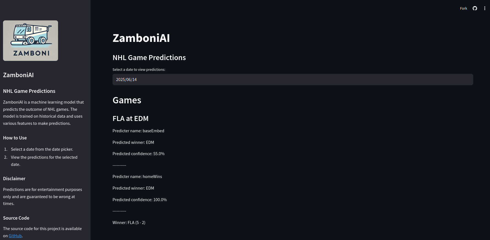

# zamboni

*
This AI-generated (DALL-E) image of a zamboni is obviously inacurrate, reminding us to pursue our objective cautiously.
*

Download a comprehensive set of NHL game, player, and team data and load into a SQL database. Export in format for analysis and training of ML models.

## Installation

First setup your environment as you prefer. For example if using `venv`:

` python -m venv venv `
` source venv/bin/activate `

Then:

` pip install . `

## Run

` python -m zamboni `

The program will proceed in several steps:

#### Download from NHL API

You may first wish to get some familiarity with the API's functionality. The notebook APIWalkthrough.ipynb gives various examples of API calls used by this package.

` jupyter lab notebooks/APIWalkthrough.ipynb `

Relevant data is placed into text files in CSV format. Games are placed into a file containing all historical games and another for the current day's games. Team information is placed into a separate file.

#### Load into SQL database

The data will be loaded from the text files into a SQLite database, which will contain several tables including game and team tables. Several views will be created which will facilitate the preparation of data for export. Status tables will hold the last successful dates of various program functions for failure tolerance and efficient incremental updating.

After data is loaded into the DB, it can be explored using the notebook DataExploration.ipynb.

` jupyter lab notebooks/DataExploration.ipynb `

#### Export to ML-friendly format

Game data is formatted for input to ML training and exported to parquet files. Separate files are again created for games before the current day and games on the current day.

#### Training

The ML model is trained from scratch if running for the first time, or incrementally if an existing model is found. Training is performed over games after the last training date stored in the DB and before the current day. After a successful training, the last training date is set to today.

#### Reporting

After the model is updated to have been trained on all days before the current date, the model is evaluated on today's games. It is assumed that this is done before any outcomes for today's games are known. A log file is created with the predictions for each of today's games.

#### Predicters

Predicters are the name of the general class that implements the logic for predicting the outcome of a single game. It can be simple logic or it can be a machine learning model. Two examples, HomeTeamWinsPredicter and NNGamePredicter, are provided. Custom predicters can be implemented by inheriting from the GamePredicter base class.

#### Backtesting

A particular Predicter can be tested over a time range by using the `backtest` command. If the predicter has a trainable element, this will be done according to the appropriate strategy as described in the next section. Predictions for a given Predicter and date will be stored in the GamePredictions table of the database.

#### Training Strategy

There are many ways to train a machine learning for prediction over a range of time. For example, you can train over a some past range of games, freeze, your model, and then evaluate going forward. You can also start with an initialized model and train then predict iteratively over the whole date range, which gives a more accurate picture of the expected performance using the daily updates described above. The precise method for training is encapsulated in the TrainingStrategy class. Two strategies are compared in the notebook that can be run as:
` jupyter lab notebooks/StrategyComparison.ipynb `

#### API

Predictions from your models can be served via FastAPI and uvicorn. I can be launched by running:

` python scripts/launch_api.py `

Your model predictions for a given day can then be retrieved by accessing `/zamboni/api/{date}` e.g. `/zamboni/api/2025-06-14`. For a working example see `https://nicholas-luongo.com/zamboni/api/2025-06-14`.

#### Streamlit

A Streamlit app can be launched that displays the predictions for a chosen date. To launch run:

` python streamlit run src/zamboni/streamlit.py `

An example of the running dashboard can be found at:

` https://zamboni.streamlit.app/ `

A screenshot of the dashboard is shown below:

*
A screenshot of the Streamlit dashboard.
*
